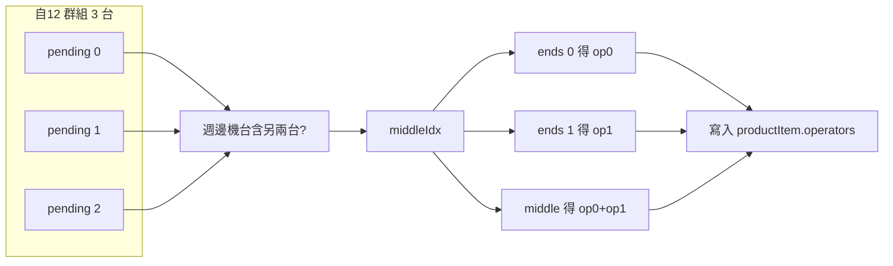

# 自12 共享人力條件重構：中間機台雙人操作

## 需求摘要

- **現況**（[排班條件.md](src/services/排班條件.md) L44）：自12 = 2 人可操作 3 機台，同一組 2 人對 3 台機台都是「整組一起」分配。
- **新規則**（依週邊機台關係）：
  - 機台 1 週邊機台 = [2]；機台 2 週邊機台 = [1,3]；機台 3 週邊機台 = [2]。
  - **兩端機台**（1、3）：各由 **1 人** 操作（機台 1 → 人員1，機台 3 → 人員2）。
  - **中間機台**（2，其週邊機台包含 1 與 3）：由 **人員1、人員2 同時** 操作。

亦即：依「週邊機台」找出 3 台中的「中間」那一台，僅中間機台分配 2 人，其餘兩台各 1 人。

---

## 實作策略

目前 [schedulingService.js](src/services/schedulingService.js) 在 L109–224 處理自12：每加入一台就立刻把「整組 2 人」寫進該機台的 `productItem.operators`。要支援新規則，必須改成「先收集同一群組的 3 台，再依中間／兩端一次分配」。

1. **延後寫入 operators**
  自12 群組在未滿 3 台前，不寫入 `productItem.operators`，只把「機台 + 對應 productItem」放進群組的待分配列表。
2. **群組滿 3 台時一次分配**
  當第 3 台加入、群組滿 3 台時：  
  - 用「週邊機台」判斷哪一台是「中間」；  
  - 中間機台：`operators = [人員1, 人員2]`；  
  - 兩端機台：依處理順序，第一台 `[人員1]`、第三台 `[人員2]`。
3. **未滿 3 台就結束的群組**
  若同一自12 群組只出現 1 或 2 台（例如該時段只有 2 台自12），維持現行行為：這兩台都分配「整組 2 人」，不套用中間／兩端規則。

---

## 資料結構與流程

### 1. 群組結構擴充

`sharedLaborGroups.get(groupKey)` 目前為：

```js
{ operators: matchedOperators, machineCount: 1, maxMachines: 3 }
```

改為同時存放「待分配列表」，例如：

```js
{
  operators: [...],           // 2 人
  machineCount: 1,
  maxMachines: 3,
  pending: [{ machine, productItem }, ...]  // 本群組內機台與其 productItem（尚未寫入 operators）
}
```

- 每加入一台自12 機台：`machineCount++`，並 push `{ machine, productItem }` 到 `pending`，**不**寫入 `productItem.operators`（可先設 `productItem.status = '已排'`、remark 照舊）。
- 當 `machineCount === 3` 時，對 `pending` 做「中間／兩端」判斷並寫入各 `productItem.operators`，然後 `sharedLaborGroups.delete(groupKey)`。

### 2. 判斷「中間機台」

3 台在 `pending` 中的順序 = 排班迴圈處理順序（即 `sortedMachines` 順序）。  
`machine.週邊機台` 為 snkey 陣列（與 [hasConflict](src/services/schedulingService.js) L359–360 一致）。

- **中間機台定義**：該機台的 `週邊機台` 陣列包含「另外兩台機台的 snkey」。
- 實作：對 `pending` 中三筆，找出索引 `middleIdx`，使得  
`pending[middleIdx].machine.週邊機台` 包含 `pending[其他兩索引].machine.snkey`。  
（需處理 `週邊機台` 為 undefined/null 時以空陣列代替。）

### 3. 分配規則（群組滿 3 台時）

- 令 `op0 = group.operators[0]`, `op1 = group.operators[1]`。
- 兩端索引：`ends = [0,1,2].filter(i => i !== middleIdx)`，依序為「第一端、第二端」。
- 寫入：
  - `pending[ends[0]].productItem.operators` = 對應 `op0` 的單人陣列；
  - `pending[ends[1]].productItem.operators` = 對應 `op1` 的單人陣列；
  - `pending[middleIdx].productItem.operators` = `[op0, op1]`（兩人皆寫入，格式與現有 `{ snkey, name, startTime, endTime }` 一致）。

Remark 可依需要區分「共享人力-兩端」與「共享人力-中間」，或維持現有「共享人力 (1/3)」「(2/3)」「(3/3)」等說明。

### 4. 未滿 3 台就結束的群組（1 或 2 台）

- **觸發時機**：  
  - 同一 `groupKey` 下一台機台不是自12，或  
  - 迴圈結束時，該群組仍存在且 `pending.length` 為 1 或 2。
- **行為**：對該群組內所有 `pending[i].productItem` 寫入 `operators = group.operators`（整組 2 人），與目前邏輯一致，不套用中間／兩端規則。

實作上可在「新機台要加入自12 群組、且目前群組已滿 3 台」時先對現有群組做「3 台一次分配」再建新群組；並在 `generateSchedule` 迴圈結束後，對 `sharedLaborGroups` 中剩餘的每個群組做「未滿 3 台」的補寫入。

---

## 檔案與修改點


| 檔案                                                                     | 修改內容                                                                                                                                                                                                                                       |
| ---------------------------------------------------------------------- | ------------------------------------------------------------------------------------------------------------------------------------------------------------------------------------------------------------------------------------------ |
| [src/services/schedulingService.js](src/services/schedulingService.js) | 自12 區塊（約 L109–224）：(1) 群組結構加入 `pending`；(2) 加入時不直接寫 `productItem.operators`，改 push 到 `pending`；(3) 當 `machineCount === 3` 時呼叫新函式 `assignSelf12Group(group)`，依週邊機台算 `middleIdx` 並寫入三筆 `productItem.operators`；(4) 迴圈結束後對剩餘群組做「未滿 3 台」的整組寫入。 |
| [src/services/排班條件.md](src/services/排班條件.md)                           | 更新「七、共享人力（自12）規則」：說明兩端機台各 1 人、中間機台（依週邊機台判斷）為 2 人；並註明未滿 3 台時仍為整組 2 人。                                                                                                                                                                       |


---

## 輔助函式建議

- `**findMiddleIndexInSelf12Group(pending)**`  
輸入 `pending = [{ machine, productItem }, ...]`（長度 3），回傳 `middleIdx`（0、1 或 2）。  
邏輯：對每個 `i`，檢查 `pending[i].machine.週邊機台` 是否包含另外兩台的 `machine.snkey`；若多台符合可約定取第一個。
- `**assignSelf12Group(group)**`  
當 `group.pending.length === 3` 時：呼叫 `findMiddleIndexInSelf12Group`，依上述規則寫入 `group.pending[0..2].productItem.operators`。

---

## 流程簡圖（群組滿 3 台時）




---

## 注意事項

- `週邊機台` 比對請用 `machine.snkey`（與現有 hasConflict 一致）；若日後改為機台編號再一併調整。
- 不改變「誰被選進群組」的邏輯（仍為 `findBestOperators` 取 2 人），僅改變「這 2 人如何分配到 3 台」的規則。
- 若 3 台裡沒有任何一台的週邊機台包含另外兩台（資料異常），可 fallback：三台都給整組 2 人，避免漏排。

