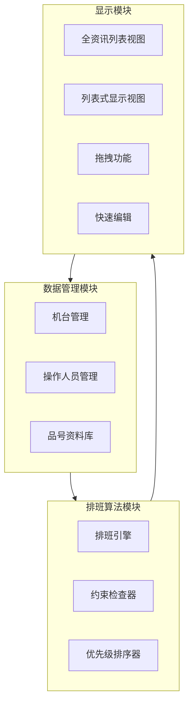

# 自动排班系统实施计划

## 系统架构概览




## 实施任务

### 1. 数据管理模块

#### 1.1 机台管理 (`src/views/main/Machine/`)

- **index.vue**: 机台列表页面
- 显示46个机台
- 支持新增、编辑、删除
- 字段：机台名称、周边机台（多选）、执行品号（多选，有序）、生产优先（六种等级）
- **Add.vue**: 机台新增/编辑弹窗
- 表单字段验证
- 周边机台多选下拉
- 品号多选（支持排序）
- 生产优先选择器（方塊/大圈/小圈/大三角/小三角/空白）

#### 1.2 操作人员管理 (`src/views/main/Operator/`)

- **index.vue**: 操作人员列表页面
- 显示所有操作人员
- 支持新增、编辑、删除
- 字段：人员名称、可上班时段（多选：早/中上/中下/晚）、性别、不合对象（多选snkey）、对应品号（技术能力，多选）、状态
- **Add.vue**: 操作人员新增/编辑弹窗
- 时段多选
- 不合对象关联选择（显示人员列表）
- 品号技术能力多选

#### 1.3 品号资料库 (`src/views/main/ProductCode/`)

- **index.vue**: 品号列表页面
- 显示品号与人力代码对应关系
- 支持Excel导入
- 字段：品号、人力代码（可能多个）
- **importProductCode.vue**: Excel导入组件
- 参考 `importCustomer.vue` 的实现
- 解析Excel：品号列、人力代码列
- 支持多个人力代码（用分隔符或多列）

### 2. 排班算法模块

#### 2.1 排班核心服务 (`src/services/schedulingService.js`)

- **generateSchedule(date, shift)**: 生成指定日期和时段的排班
- 输入：日期、时段（早/中上/中下/晚）
- 输出：排班结果数组
- **核心逻辑**：

1. 获取所有机台（按生产优先级排序）
2. 获取可用操作人员（过滤状态、时段）
3. 对每个机台：

    - 通过品号获取人力代码
    - 根据人力代码确定需要人数
    - 匹配操作人员（考虑技术能力、不合对象、周边机台）
    - 分配人员到机台
- **约束检查**：
- 不合对象检查（通过周边机台判断）
- 技术能力匹配（对应品号优先）
- 时段可用性
- 状态检查（只使用"上班"状态）

#### 2.2 人力代码解析器 (`src/utils/laborCodeParser.js`)

- **parseLaborCode(code)**: 解析人力代码
- `手1` → { type: 'manual', count: 1, machines: 1 }
- `手2` → { type: 'manual', count: 2, machines: 1 }
- `手3` → { type: 'manual', count: 3, machines: 1 }
- `自12` → { type: 'semi-auto', count: 2, machines: 3 }
- `自01` → { type: 'semi-auto', count: 1, machines: 1 }
- `自` → { type: 'auto', count: 0, machines: 1 }

#### 2.3 优先级排序器 (`src/utils/prioritySorter.js`)

- **sortByPriority(machines)**: 按生产优先级排序
- 优先级：方塊(1) > 大圈(2) > 小圈(3) > 大三角(4) > 小三角(5) > 空白(6)

### 3. 排班显示模块

#### 3.1 排班主页面 (`src/views/main/Scheduling/`)

- **index.vue**: 排班主页面
- 日期选择器
- 视图切换（全资讯列表 / 列表式显示）
- 自动排班按钮
- 保存/导出功能

#### 3.2 全资讯列表视图 (`src/views/main/Scheduling/TableView.vue`)

- 表格样式显示
- 列：机台名称、早班人员、中上班人员、中下班人员、晚班人员、品号、生产优先
- 支持单元格编辑
- 支持拖拽调整人员

#### 3.3 列表式显示视图 (`src/views/main/Scheduling/ListView.vue`)

- 分早中晚三个区域，不同颜色
- 每个机台显示为卡片/区块
- 显示：机台名称、品号、生产优先、分配人员
- 支持拖拽移动/复制区块内容
- 颜色区分：
- 早班：浅蓝色
- 中班：浅黄色
- 晚班：浅紫色

#### 3.4 拖拽功能组件 (`src/components/Scheduling/`)

- **DraggableBlock.vue**: 可拖拽的区块组件
- 使用 HTML5 Drag and Drop API 或 vue-draggable
- 支持移动和复制
- 拖拽时显示预览

#### 3.5 快速编辑组件 (`src/components/Scheduling/QuickEdit.vue`)

- 点击区块弹出快速编辑对话框
- 字段：品号选择、人员选择、操作时间、备注
- 记录：人、操作时间、备注

### 4. 数据结构和API接口

#### 4.0 資料儲存格式規範

**重要：所有資料庫存檔時必須使用以下格式**

- **新增資料時**：
  ```javascript
          const postData = {
            datalist: JSON.stringify(list.value)
          }
          await api.add(database, postData)
  ```


- **編輯資料時**：
  ```javascript
          const postData = {
            snkey: list.value.snkey,
            datalist: JSON.stringify(list.value),
            updateTime: dayjs().format("YYYY-MM-DD HH:mm:ss")
          }
          await api.post(database, postData)
  ```


- **刪除資料時**：
  ```javascript
          const postData = {
            snkey: item.snkey,
            tablename: database,
            datalist: JSON.stringify(item)
          }
          await api.delete(database, postData)
  ```


所有資料都必須將整個物件透過 `JSON.stringify()` 轉換為字串後，存放在 `datalist` 欄位中。

#### 4.1 数据结构定义 (`src/types/scheduling.js`)

```javascript
// 機台資料結構（存檔時會包含 createInfo 和 editInfo）
Machine {
  snkey: string,
  機台名稱: string,
  週邊機台: string[], // snkey陣列
  執行品號: string[], // 有序品號陣列
  生產優先: string, // '方塊'|'大圈'|'小圈'|'大三角'|'小三角'|'空白'
  createInfo: { snkey: string, name: string, time: string },
  editInfo: Array<{ snkey: string, name: string, time: string }>
}

// 操作人員資料結構（存檔時會包含 createInfo 和 editInfo）
Operator {
  snkey: string,
  人員名稱: string,
  可上班時段: string[], // ['早','中上','中下','晚']
  性別: string, // '男'|'女'
  不合對象: string[], // snkey陣列
  對應品號: string[], // 品號陣列（技術能力）
  狀態: string, // '上班'|'休假'|'請假'|'離職'
  createInfo: { snkey: string, name: string, time: string },
  editInfo: Array<{ snkey: string, name: string, time: string }>
}

// 品號資料結構（存檔時會包含 createInfo 和 editInfo）
ProductCode {
  snkey: string,
  品號: string,
  人力代碼: string[], // 可能多個
  createInfo: { snkey: string, name: string, time: string },
  editInfo: Array<{ snkey: string, name: string, time: string }>
}

// 排班結果資料結構（存檔時會包含 createInfo 和 editInfo）
ScheduleResult {
  snkey: string,
  date: string, // YYYY-MM-DD
  shift: string, // '早'|'中上'|'中下'|'晚'
  machineSnkey: string,
  operatorSnkeys: string[], // 分配的人員snkey陣列
  品號: string,
  操作時間: string,
  備註: string,
  createInfo: { snkey: string, name: string, time: string },
  editInfo: Array<{ snkey: string, name: string, time: string }>
}
```


#### 4.2 API接口调用（基于现有api.js）

- `api.get('machine')` - 获取所有机台
- `api.get('operator')` - 获取所有操作人员
- `api.get('productcode')` - 获取所有品号
- `api.get('schedule')` - 获取排班记录
- `api.post('schedule')` - 保存排班结果
- `api.add('machine')` / `api.post('machine')` - 机台CRUD
- `api.add('operator')` / `api.post('operator')` - 操作人员CRUD
- `api.addMulti('productcode')` - 批量导入品号

### 5. 路由配置

在 `src/router/index.js` 中添加：

```javascript


{ path: 'Machine', name: 'Machine', component: () => import('@/views/main/Machine/index.vue') },
{ path: 'Operator', name: 'Operator', component: () => import('@/views/main/Operator/index.vue') },
{ path: 'ProductCode', name: 'ProductCode', component: () => import('@/views/main/ProductCode/index.vue') },
{ path: 'Scheduling', name: 'Scheduling', component: () => import('@/views/main/Scheduling/index.vue') },
```


### 6. Store状态管理

在 `src/stores/useStore.js` 中添加排班相关状态：

- `scheduleData`: 当前排班数据
- `selectedDate`: 选中的日期
- `selectedShift`: 选中的时段
- `viewMode`: 视图模式（'table'|'list'）

### 7. 功能菜单

在 `src/stores/useStore.js` 的 `authKeys` 中添加：

- 机台管理
- 操作人员管理
- 品号资料库
- 排班管理

## 实施顺序

1. **第一阶段：数据管理基础**

- 实现机台管理（CRUD）
- 实现操作人员管理（CRUD）
- 实现品号资料库（列表+Excel导入）

2. **第二阶段：排班算法**

- 实现人力代码解析器
- 实现优先级排序器
- 实现排班核心服务（自动排班逻辑）

3. **第三阶段：显示功能**

- 实现全资讯列表视图
- 实现列表式显示视图
- 实现拖拽功能

4. **第四阶段：交互优化**

- 实现快速编辑功能
- 实现手动调整功能
- 优化用户体验

## 技術要點

1. **拖拽實現**：考慮使用 `vuedraggable` 或原生 HTML5 Drag and Drop
2. **資料持久化**：排班結果儲存到資料庫，支援歷史查詢
3. **衝突處理**：當人員不足時，按優先級分配，未分配的機台標記為"待排"
4. **效能優化**：46 個機台 × 3 個時段，考慮虛擬滾動或分頁
5. **Excel 匯入**：參考現有的 `importCustomer.vue` 實現，支援品號-人力代碼對應

## 界面语言规范

**重要：所有界面文本必须使用繁体中文显示**包括但不限于：

- 页面标题、按钮文字（新增、編輯、刪除、儲存、取消、匯入、匯出等）
- 表單標籤（機台名稱、人員名稱、品號、時段等）
- 提示訊息、錯誤訊息、成功訊息
- 表格欄位標題（機台名稱、早班人員、中上班人員、中下班人員、晚班人員等）
- 選項文字（早、中上、中下、晚、男、女、上班、休假、請假、離職等）
- 狀態標籤、優先級標籤（方塊、大圈、小圈、大三角、小三角、空白）
- 對話框標題、確認訊息
- Toast 提示訊息
- 功能選單項目名稱

## 注意事項

1. **資料儲存格式**：所有資料庫存檔時，必須使用 `datalist: JSON.stringify(list.value)` 格式，將整個物件轉為 JSON 字串儲存
2. **資料讀取**：從資料庫讀取時，需要使用 `JSON.parse(i.datalist)` 還原資料物件
3. 品號可能有多個，需要按從左到右的順序優先判定
4. 同一人可以同時指定多個上班時段
5. 不合對象的判斷需要通過機台的"週邊機台"欄位